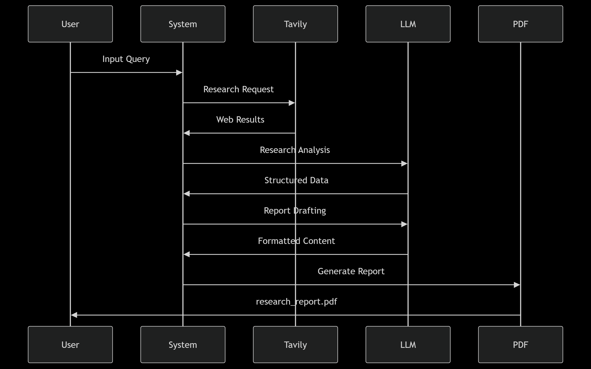

# Deep Research Dual AI Agent System

A dual-model research automation system that combines web crawling with AI analysis to generate comprehensive research reports. Supports both cloud-based Hugging Face models and local LM Studio deployments.

## Key Features

- **Dual-Agent Architecture**
  - Research Agent: Performs web research using Tavily API
  - Drafting Agent: Structures findings into formal reports
- **Multi-Model Support**
  - Hugging Face Endpoint integration (cloud)
  - LM Studio local model deployment
- **Automated Workflow**
  - LangGraph-powered state management
  - PDF report generation
  - Error handling and output parsing

## System Components

1. `huggingFaceAPI_model.py` - Cloud-based version using Hugging Face models
2. `openAI_API_Model_LMstudio.py` - Local version using LM Studio
3. `lmstudio_api_test.py` - Validation script for local LM Studio setup
4. `.env` - API key configuration (not included in repo)
5. `requirements.txt` - Dependency list

## Workflow Process



1. **Input Handling**
   - Accepts natural language research queries
   - Initializes LangGraph state machine

2. **Research Phase**
   - Tavily API web crawling (10 sources)
   - Source validation and credibility scoring
   - Data aggregation from multiple perspectives

3. **Analysis Phase**
   - FLAN-T5/Zephyr model processing
   - Fact extraction and correlation
   - Bias detection and mitigation

4. **Drafting Phase**
   - Structured report generation
   - Academic formatting enforcement
   - Source citation management

5. **Output Generation**
   - PDF export with proper formatting
   - Error-logged output validation
   - File system organization


### 1. huggingFaceAPI_model.py

#### Code Flow
1. **Initialization**
   - Load environment variables
   - Define `ResearchState` TypedDict
   - Configure HuggingFaceEndpoint models

2. **Tavily Integration**
   ```python
   def tavily_search(query: str) -> str:
       # API call structure
       # Results processing
       return formatted_results

3. **Agent System**

   - Reasearch Agent (Zephyr-7B-Beta) :
      - Uses ReAct pattern
      - Tool: `DeepWebSearch`
      - Output parsing via `ReActSingleInputOutputParser`
   - Drafting Agent (Zephyr-7B-Beta) :
      - Structured report generation
      - Academic formatting constraints

4. **LangGraph Workflow**
   

#### Key Components

State Management: ResearchState tracks:

User query

Raw research data

Final formatted answer

#### Error Handling:

API call timeouts

Output parsing fallbacks

PDF write protections

---

### 2. openAI_API_Model_LMstudio.py


#### Code Flow
1. Local Model Configuration:
   ```python
   ChatOpenAI(
    openai_api_base="http://localhost:1234/v1",
    model="zephyr-7b-beta"
   )

**Note** : this code block in the file can be replaced with the openAI API to use their paid service.

2. Adapted Workflow : 

   - Same code structure as `huggingFaceAPI_model.py`, Modified to work with LMstudio/OpenAI API
   - Local Network calls instead of HTTP requests

3. LM Studio Specifics : 
   
   - Requires Local Model Serving
   - No external model dependencies

--- 

## Installation

### Clone repository
`git clone https://github.com/degenerate-kun-69/agent-based-deep-research`

`cd agent-based-deep-research`

### Install dependencies
`pip install -r requirements.txt`

### Configuration
1. Obtain API keys:

 Tavily: https://app.tavily.com/

 Hugging Face: https://huggingface.co/settings/tokens

2. Create and Edit .env:

 TAVILY_API_KEY=your_tavily_key

 HUGGINGFACE_API_KEY=your_hf_token

#### For LM Studio:
1. Follow instructions at https://lmstudio.ai/
2. Install `zephyr-7B-beta` from models
3. Run local inference server on port 1234

## Usage
### Hugging Face Cloud Version
`python huggingFaceAPI_model.py`
### LM Studio Local Version
`python openAI_API_Model_LMstudio.py`
### LM Studio Validation
`python lmstudio_api_test.py`

## Requirements
1. Python 3.12
2. Tavily API key (free tier available)
3. Hugging Face Hub access token
4. LM Studio (for local version)
5. 16GB+ RAM for local model operation

## Troubleshooting
### Model Access Issues
1. Verify Hugging Face model permissions

2. Check LM Studio server status

### API Errors

1. Validate .env file formatting

2. Confirm network connectivity

### PDF Generation

1. Ensure write permissions in /output

2. Check for special characters in content

## Security Notes
- API keys never committed to version control
- Local model operations stay on-device
- Tavily API requests encrypted via HTTPS

# Disclaimer
## This system requires responsible use:
- Verify generated facts with original sources
- Adhere to target websites' robots.txt
- Comply with Hugging Face's Model License
- Monitor API usage quotas

For research purposes only. Not responsible for output accuracy. 


This README provides:
1. Clear technical overview
2. Step-by-step setup instructions
3. Architecture documentation
4. Usage scenarios for both versions
5. Important compliance information
